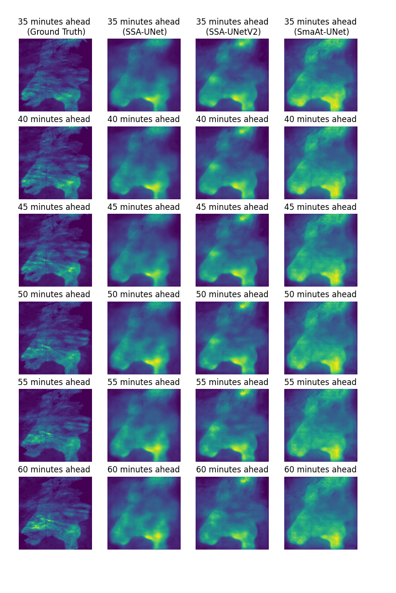
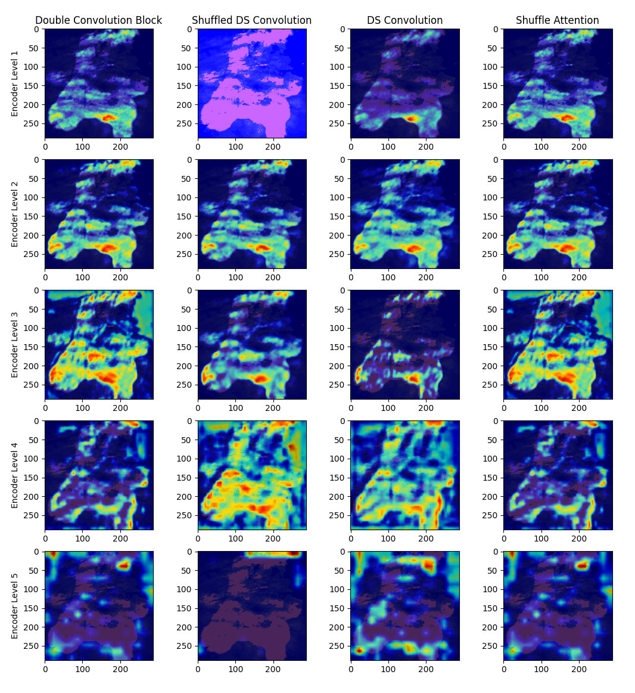
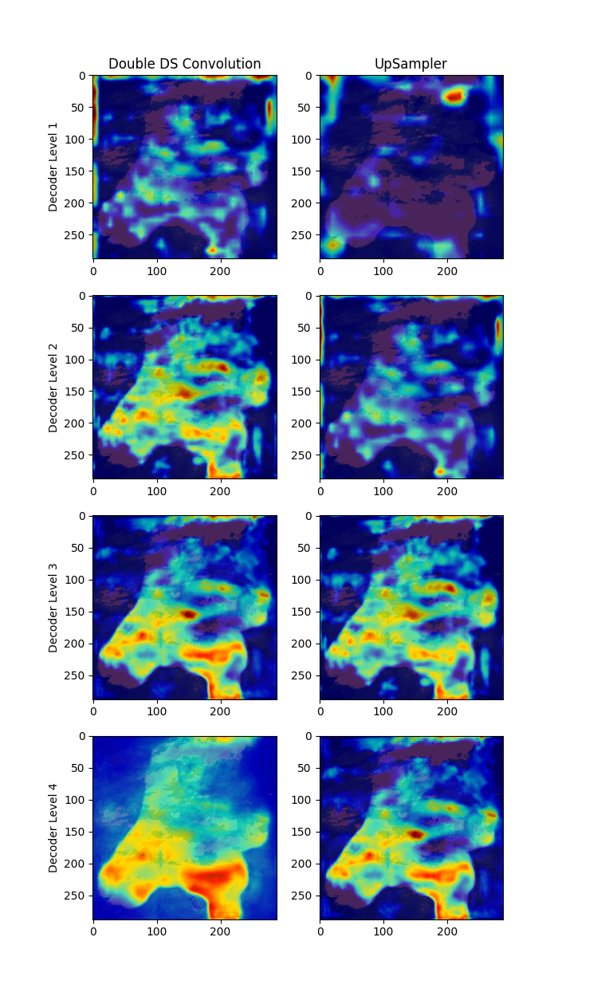

# SSA-UNet
Code for the Paper "SSA-UNet: Advanced Precipitation Nowcasting via Channel Shuffling" accepted for publication in the proc. of the [International Joint Conference on Neural Networks (IJCNN 2025)](https://2025.ijcnn.org/).
.png)

# Requirements

The following libraries are needed to run our scripts

```
tqdm
torch
lightning
matplotlib
tensorboard
torchsummary
h5py
numpy
```

# Dataset

Precipitation data from the [Royal Netherlands Meteorological Institute (KNMI)](https://www.knmi.nl/over-het-knmi/about) is used, including nearly 420,000 rain maps collected at 5-minute intervals from 2016 to 2019. This dataset covers the Netherlands and adjacent areas and is produced by two C-band Doppler radar stations positioned in De Bilt and Den Helder.

If you are interested in the dataset that we used please write an e-mail to: [s.mehrkanoon@uu.nl](s.mehrkanoon@uu.nl)

Use [create_dataset.py](./create_datasets.py) to create the 50% and 20% datasets from the original dataset.

The dataset is already normalized using a Min-Max normalization. In order to revert this you need to multiply the images by 47.83; this results in the images showing the mm/5min.

# Training

Use [train_precip_lightning.py](./train_precip_lightning.py) to start the training process. After each checkpoints are generated and stored in `lightning/precip_regression`. Each checkpoint name contains its validation error value, the final model will probably be one with the lowest value.




# Testing

In order to compute all the metrics for your model you first need to move `lightning/precip_regression/comparison`. Once all the models have been moved, use [test_precip_lightning.py](./test_precip_lightning.py) to compute the metrics.

# Explainability

The XAI plots can be obtained by running the cam_segmentation_precip.py script. The code used was obtained at https://github.com/jacobgil/pytorch-grad-cam and adapted to our dataset and model.




```
@misc{turzi2025advanced,
      title={SSA-UNet: Advanced Precipitation Nowcasting via Channel Shuffling}, 
      author={Marco Turzi and Siamak Mehrkanoon},
      year={2025}, 
}
```

